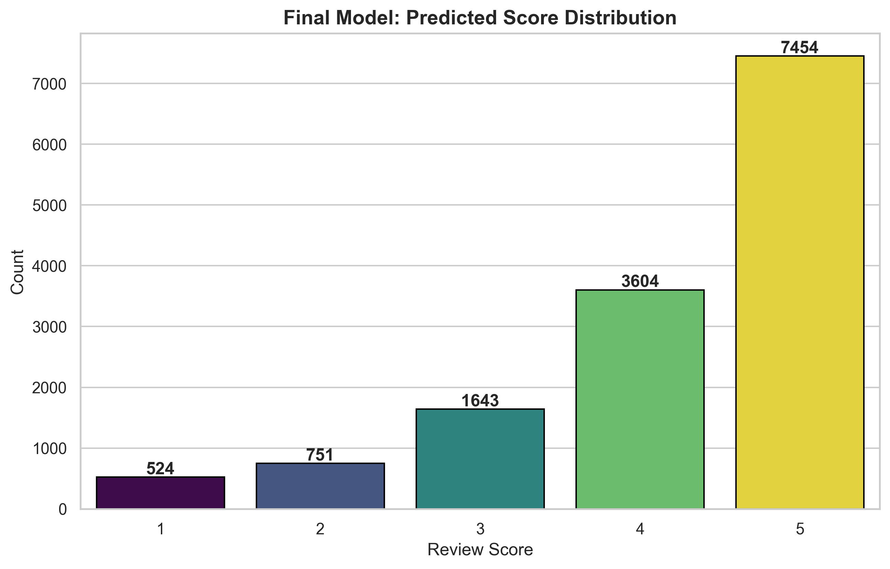

# Amazon Fine Food Reviews: Score Prediction Pipeline
### CS 506 Spring 2026 Midterm Project

## 1. Project Overview
This repository contains a machine learning pipeline designed to predict customer review scores (1 to 5) for Amazon Fine Food products. The project optimizes for the **Quadratic Weighted Kappa (QWK)** metric by integrating textual analysis with user and product behavioral data.

## 2. Technical Workflow

### Stage 1: Behavioral Analysis (Target Encoding)
Review scores are often influenced by individual reviewer habits and inherent product quality. 
* **User Bias**: We capture whether a user is consistently "harsh" or "generous" by calculating their average historical score.
* **Product Bias**: We account for product quality by calculating the average rating for each `ProductId`.
* **Smoothing**: A smoothing factor ($\lambda = 10$) is applied to prevent data from users or products with very few reviews from skewing the results.

### Stage 2: Hybrid Feature Engineering
We combine massive textual data with numerical metadata to provide a comprehensive view of each review:
* **Textual Features (150,000 Dimensions)**:
    * **Word n-grams (1-3)**: Captures phrases like "not good" or "highly recommend".
    * **Character n-grams (3-6)**: Handles morphological variations and common typos (e.g., "deliciousss").
* **Numerical Meta Features**:
    * **Lengths**: Review and summary character counts.
    * **Helpfulness**: The ratio of helpfulness numerators to denominators.
    * **Averages**: The smoothed user and product scores from Stage 1.
* **Scaling**: We use `MinMaxScaler` to ensure all numerical features are non-negative, which is a requirement for the Naive Bayes component of our ensemble.

### Stage 3: Triple-Model Ensemble
Instead of a single algorithm, we use a weighted ensemble to balance different mathematical approaches:
1.  **SGDClassifier (55%)**: A linear model optimized for large-scale sparse text data using `log_loss`.
2.  **Logistic Regression (30%)**: A stable model using the `lbfgs` solver, which excels at interpreting numerical features.
3.  **ComplementNB (15%)**: A specialized Naive Bayes variant designed to handle imbalanced datasets.

### Stage 4: Threshold Optimization (QWK)
Standard rounding is often suboptimal for the QWK metric. We treat the ensemble's output as a continuous score and use the **Nelder-Mead algorithm** to find the optimal boundaries between classes (e.g., 1 vs 2, 4 vs 5) to maximize the final competition score.

## 3. Results
The predicted score distribution reflects the real-world skew of Amazon data, where 4 and 5-star reviews significantly outnumber lower scores.

*The bar chart above visualizes the final prediction counts across the 1-5 score range.*

## 4. How to Run
### Prerequisites
* Python 3.12+
* Libraries: `pandas`, `numpy`, `scikit-learn`, `scipy`, `matplotlib`, `seaborn`

### Execution
1. Ensure `train.csv`, `test.csv`, and `sample.csv` are in the project root.
2. Open and run all cells in `kaggle.ipynb`.
3. The script will generate `submission.csv` and a distribution plot.

---
**Author**: Chengda Lin (darrenlin2003)  
**Date**: April 6, 2026
